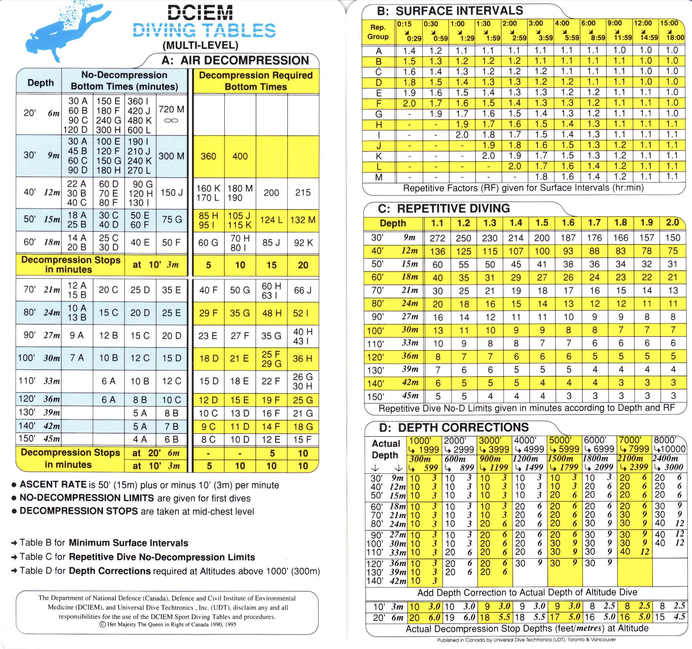

```{r setup, include=FALSE}
knitr::opts_chunk$set(echo = TRUE)
```
### DCIEM tables

Click below for the full DCIEM tables and [here](https://www.divegearexpress.com/amfile/file/download/file/143/product/8927/) for the full DCIEM manual.

<a href="images/DCIEM.jpg"></a>
