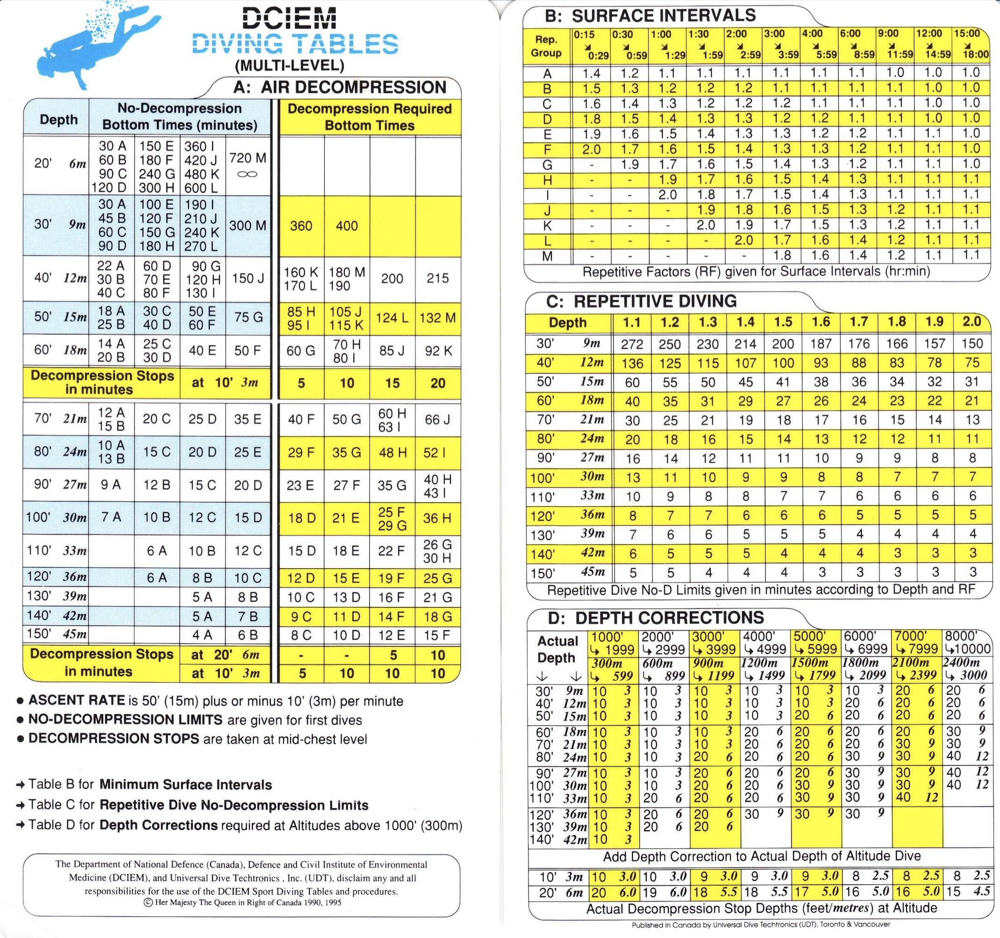

Dive tables are a series of `ifelse` statements. For example:

-   if depth is \<6 metres and time is \<30 minutes then "A"

    else

-   if depth is \<6 metres and time is \<60 minutes then "B"

    else....



The DCIEM package writes a series of simple `ifelse` statments into functions:

### Repetitive Groups:

The `get_RG()` function calculate repetitive groups:

```{r}
library("DCIEM")

get_RG(depth=12, bottomtime = 18)
get_RG(30, 60)

```

`get_RG()` also works with nitrox calculations by specifying the mix and calculating the Equivalent Air Depth (see `EAD()` below for function details:

```{r}

get_RG(depth=12, bottomtime=58) # default air settings to 21 Nitrox

get_RG(depth=12, bottomtime=58, EANx=36) 
```

### Equivalent Air Depth

To calculate Equivalent Air Depth outside of `get_RG()` use the `EAD()` function where:

EAD = (depth + 10) × (fraction of N2 / 0.79) − 10

```{r}

EAD(EANx=36, depth=12)
EAD(32, 17)
```

### Repetitive Factors

To calculate the Repetitive Factor (RF) after a surface interval use `get_RF()`

```{r}
get_RF(RG = "A", surfaceinterval = 50) # surfaceinterval in minutes
get_RF("C", 16)
```
